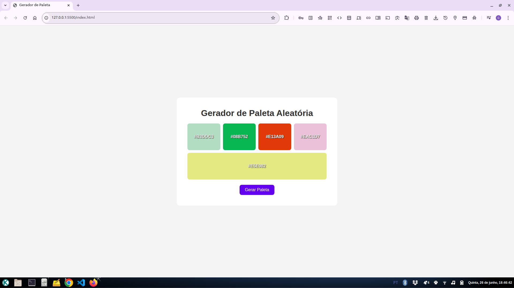

# Gerador de Paleta Aleatória

Um gerador de paletas de cores simples e responsivo feito com *HTML, **CSS* e *JavaScript*.

## Funcionalidades

- Gera uma nova paleta de cores aleatórias com um clique
- Exibe as cores em caixas grandes e legíveis
- Permite *copiar o código hexadecimal* clicando na cor
- Feedback visual de “Copiado!” ao clicar
- Interface responsiva e moderna



## Como usar

1. Clone o repositório:
   ```bash
   git clone https://github.com/gizbra/geradordecores.git